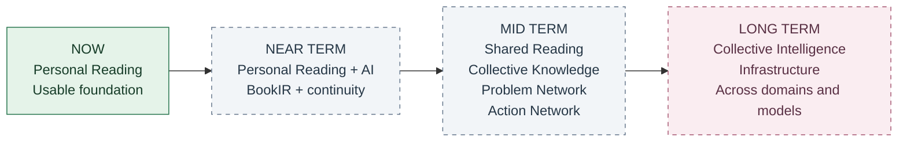
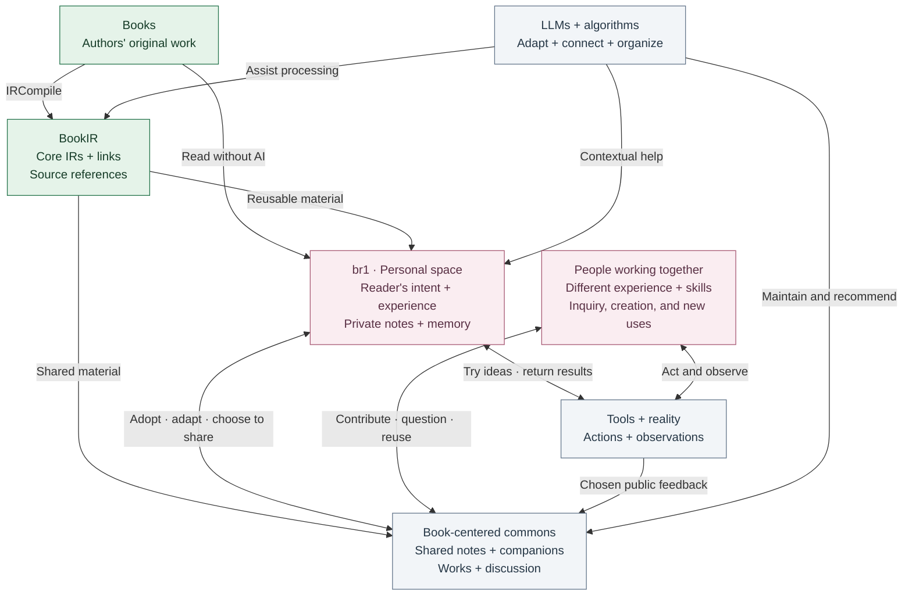

# Bridge Reader

**A personal reading space. A doorway into human-AI collective intelligence.**

Calling a model is not the same as gaining an ability. An explanation must connect with someone's experience; a useful work must be possible to pick up and continue; different people's observations must be able to change what the group understands.

Our ambition is a network where **people, books, AI, creative works, and real-world experience become useful to one another**. A question can find an explanation, a work can find a collaborator, and a result can change the next person's starting point. The goal is not simply more generated content, but capability that people can use, inherit, question, and develop together.

**Bridge Reader (`br1`) is the personal reading client within that larger vision.** It is an open-source, local-first desktop app built with Tauri and SvelteKit. Today, you can read books, keep your notes, and compare texts side by side. Personal reading should remain valuable on its own, whether or not you ever share or join a community.


## The Road Ahead

**Current stage: the reading foundation is usable and under active development.** BookIR and the broader AI reading, creation, and collaboration workflows below are not yet delivered as an integrated product.



Solid outline: available foundation. Dashed outlines: goals, not shipped capabilities or dated commitments. The directions can overlap; a small experiment or shared annotation need not wait for the whole ecosystem.

- **Near term: personal capability.** Complete reader-reliability work and connect BookIR, contextual help, and personal memory into a reading experience that can continue across sessions. Begin with a small, source-linked example; model or compilation failures must not prevent ordinary reading.
- **Mid term: continuity and collaboration.** Develop shared reading, cross-book knowledge, and problem-focused cooperation: someone adopts a companion, another person adds a missing condition or a new expression, and a small practical test changes the shared reference. Contributions, voluntary commitments, and results should remain distinguishable.
- **Long term: collective intelligence infrastructure.** Connect people, models, tools, and reusable works across domains and real-world activities. The ambition is sustained capability beyond what participants started with, with feedback that can revise both shared knowledge and the rules used to organize it.

## The Larger Network

Three kinds of progress matter, and none automatically proves the next:

1. **Personal capability:** help someone understand, create, make a judgment, or use a capability through a delegation they can check and correct.
2. **Continuity:** preserve enough context for the same person or someone else to use a work again, adapt it, or take it in a new direction without reconstructing everything from scratch.
3. **Collective gains:** let different experience, missing conditions, new expressions, and independent checks produce something no participant brought to the activity alone.

Books are the initial shared ground, not the limit of the network. They offer sustained context and sources people can return to. Questions, search, social connections, and compelling works help people discover an entry point. From there, reading can become shared inquiry, an experiment, a story, a game, a collaboration, or an activity in the world.

**Target network, not a diagram of shipped services.** The personal space is one part of the network; neither br1 nor an LLM is the owner of every activity.



**The important connections are shaped by participation, not inferred from books alone.** A model may already know an explanation that a particular person cannot yet use. Someone's experience, a different expression, or a shared activity may supply the missing connection. Keeping those conditions can help a later reader; a later disagreement or result may expose where they fail. This is the accumulation hypothesis we want to test, not a claim of proven network effects.

LLMs help interpret, generate, connect, and organize; other algorithms help with discovery and maintenance. They should use permitted context and feedback to improve the fit between a person's needs and available help. A model's interpretation of a reader, a connection, or a result remains a revisable inference, not an established fact. The platform maintains those mechanisms and their rules. People retain their own intentions, decide what to share and commit to, and can correct the system's interpretation, pause, or leave. Relevant expertise is not an obligation to answer everyone.

The network should also support uses its designers did not prescribe. Someone may borrow a perspective from philosophy to make a game, turn a statistical idea into an instrument, or bring an unfinished work to people with complementary skills. Art, play, companionship, and quiet reading have value without having to become lessons or scientific tests.

### Where br1 Fits

| Part of the ecosystem | Its responsibility |
| --- | --- |
| **Books and BookIR** | Keep original material available while exposing a compact, source-linked representation for different uses. BookIR is an established architectural layer; its internal representation and interfaces are evolving. |
| **IRCompile and reads** | IRCompile is the material-processing role. The companion `reads` work provides per-book editing, preparation, and evaluation experience; processing need not run inside the reading interface. |
| **br1** | Provide an independent personal reading space, manage BookIR generation and use, and connect the chosen material with a reader's questions, annotations, and continuing context. These are the client's direction, not all current capabilities. |
| **LLMs and algorithms** | Assist material processing and personal use; organize permitted public contributions, discovery, and maintenance. Models can change without erasing source or human contribution history. |
| **People and shared spaces** | Create and adopt companions, contribute different experience, find collaborators, question assumptions, and develop shared works. |
| **Tools and the world** | Host domain-specific activity and return observations, results, and revisions. br1 does not need to execute every workflow itself. |

As shared work spans books, observations, and projects, the architecture may extend toward **Epistemic IR** for cross-source claims, conditions, evidence, and disagreements, and a **Cognitive Runtime** for organizing the current activity rather than just the current page. These are future network-level responsibilities, not finalized schemas or extra engines already implemented in br1.

Private memory and public accumulation remain distinct. Most people should simply adopt a version and keep their own annotations; asking a question does not create a new personal version. Creating a companion and publishing it are separate choices. Public contributions can be organized by algorithms without rewriting the original book or silently editing a creator's published version.

**The aim is useful capability with less repeated effort, not a new obligation to produce.** Original text, interpretation, outside evidence, simulation, and creative adaptation must remain distinguishable. Feedback should preserve failures and disagreements as well as successes; popularity is not proof. Understanding, creative possibilities, and workable cooperation must be considered alongside model cost, human attention, coordination, and maintenance.

## A Book as a Program

**BookIR is the architectural layer between a book and the ways people can work with it.** We treat a book as a program: BookIR represents it through a compact set of core intermediate representations (IRs) and the links between them, with references back to the original text.

This is more than splitting a book into chunks or generating a summary. The aim is to expose the relationships that hold the work together, then make them available for different depths of reading, exploration, and creation. BookIR is a committed part of the architecture; its internal forms, interfaces, and implementation are still being developed. The metaphor does not assume every book is literally executable or can be compressed without loss.

The **reader** sets the direction and retains judgment. The **book** anchors the work in the author's original expression. **BookIR** supplies reusable material and relationships. **LLMs** help process and unfold that material; they do not replace either the author or the reader. Teachers and creators can refine companions that others choose to use.

Within br1, this gives the personal reading experience its own, smaller storyline:

| Way of reading | What it opens up |
| --- | --- |
| **Read thin** | See the main thread, argument, or relationships without getting lost in detail. Return to the source when a compression leaves something out. |
| **Read thick** | Unfold a difficult point through examples, derivations, context, conditions, counterexamples, and evidence. More understanding, not merely more words. |
| **Apply and create** | Connect an idea to your own problem, turn a scene into an animation, explore a rule through a game, or try a hypothesis in practice. |

These are choices, not a required sequence. An existing companion can be useful as it is; new content and personal adaptation should be generated only where they help.

## Ideas You Can See

The following authored scenes illustrate future reading companions, not current AI generation features. They show two ways to enter a book, explore an idea, and return to the original.

### From a History Book to Strategy in Motion

Read about Cannae in **Polybius's *Histories*, Book III**, then watch the double envelopment develop: the center gives ground, Roman troops press forward, the wings turn inward, and cavalry attacks the rear. The point is to see how the parts of a strategy interact, not just memorize the outcome.


### From a Fairy Tale to an Animated Story

In **Grimm's *The Frog Prince***, a promise becomes a choice: the frog comes to the castle, the princess hesitates, then opens the door and lets him in. A short scene can make the story's meaning visible before a child returns to the original with a teacher or parent.


**These are authored scene animations, not product recordings.** They illustrate future reading companions; br1 does not yet generate games or animation. Each GIF is under 512 KB. [Sources, boundaries, and replay](docs/demos/README.md).

## Available Today

- **Your local library:** import, organize, search, and reopen books.
- **EPUB, PDF, and TXT:** read with saved progress, bookmarks, highlights, and notes.
- **Reading comfort:** chapter navigation, in-book search, font and spacing controls, page or scroll layouts, and read-aloud tools.
- **Parallel reading:** compare two texts without leaving the reader.
- **Lookup and translation:** dictionary, Wikipedia, DeepL, and Yandex integrations. External services need network access; translation requires provider configuration. Submitted lookup terms and translation text are sent to the selected provider.

The project is under active development. These reading features are distinct from the target architecture and future companions above.

### Read, Mark, and Revisit

Select a passage, preserve a highlight, and keep your own interpretation beside the book. These are screenshots of the current web reader using Jane Austen's *Pride and Prejudice*, not mockups or test books.


<details>
<summary>See text selection, reading settings, and parallel panes</summary>

**Passage-level actions:** highlight, annotate, look up, translate, read aloud, or copy.


**Make the page comfortable:** adjust typography, spacing, margins, and reading mode.


**Keep two passages in view:** navigate the reading panes independently.


</details>

## Help Build It

**We are seeking substantial, sustained LLM API/token credits and compute sponsorship.** This is more than generating one summary per book: long-form source processing, context-aware assistance, multimodal creation, and repeated checking and revision all require significant resources.

Support would fund development and evaluation, not a claim of existing large-scale usage. We intend to measure cost alongside usefulness and human review effort, and reuse good existing work where it helps.

We also welcome reader-engineering contributions, education and accessibility collaborators, and authors or teachers willing to help shape and evaluate reading companions.

[Discuss compute sponsorship or collaboration](https://github.com/ifquant/br1/issues/new?title=Bridge%20Reader%20sponsorship%20or%20collaboration)

## Build From Source

Requires Node.js, pnpm, and the sibling `foliate-js` checkout. Desktop builds also require Rust and the [Tauri 2 platform prerequisites](https://v2.tauri.app/start/prerequisites/).

```sh
git clone --branch performance https://github.com/ifquant/foliate-js.git
git clone https://github.com/ifquant/br1.git
cd foliate-js
npm ci
cd ../br1
pnpm install
pnpm dev --host 127.0.0.1
```

Open [the web frontend](http://127.0.0.1:1420/). Use `pnpm tauri dev` for the desktop app; web mode does not provide every desktop integration.

```sh
pnpm check
pnpm build        # Includes PDF vendor setup
pnpm tauri build # Desktop app and installers
```

Desktop bundles are written under `src-tauri/target/release/bundle/`.

## Acknowledgements

Bridge Reader draws on [Readest](https://github.com/readest/readest) and [Foliate](https://github.com/johnfactotum/foliate-js). Their reader-engineering foundations help us focus on a reading-first experience and its future AI bridge layer.
