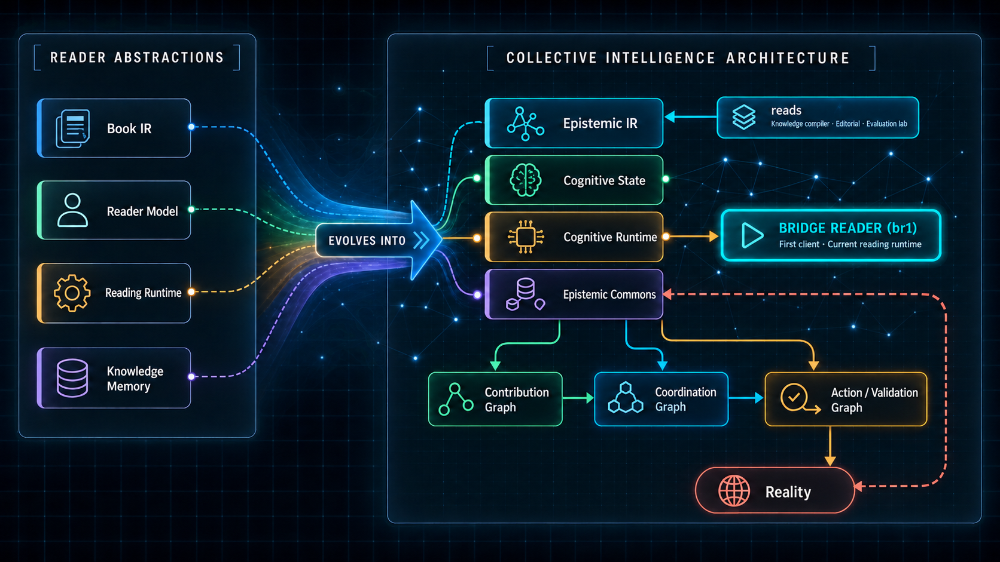
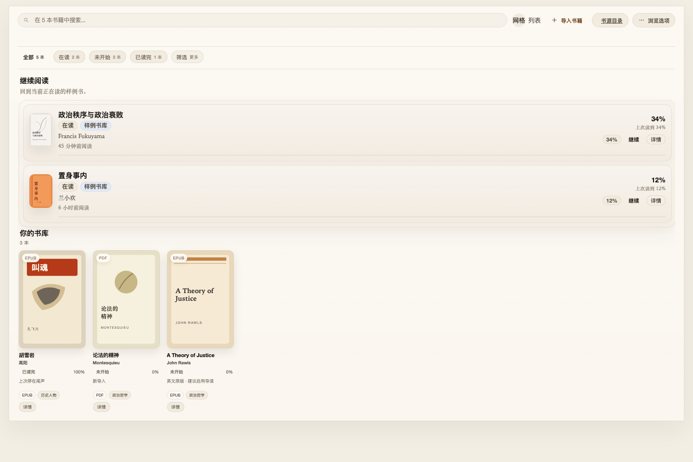
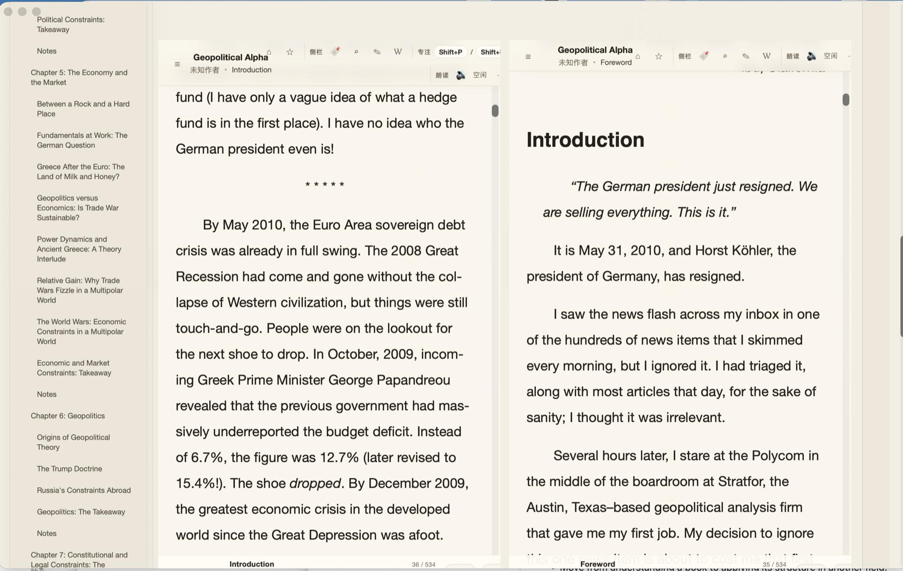

# Bridge Reader

**An AI-native reading runtime for a traceable human-AI collective intelligence network.**

Bridge Reader is an open-source, AI-native reading environment for people who want to break through cognitive bottlenecks, not simply finish more pages. It starts with a concrete question: how can a reader understand a difficult book more deeply, connect it to other domains, test its ideas against reality, and leave behind structured insight that improves the path for the next reader?

Today, `br1` is a local-first desktop reader with a library, EPUB/PDF/TXT reading, progress, notes, highlights, and parallel reading. Its longer-term role is more ambitious: Bridge Reader is the first client of a **Cognitive Runtime**, where AI mediates between authors, readers, shared knowledge, human contribution, and real-world validation.

## Vision

Our mission is to reduce cognitive friction across the full loop:

> Reality -> Information -> Knowledge -> Understanding -> Coordination -> Action -> Reality

AI should not become a central authority that owns truth. It should act as universal cognitive middleware: a compiler, translator, critic, tutor, synthesizer, librarian, and coordinator that helps people work with shared knowledge while keeping sources, evidence, disagreement, and human judgment visible.

Bridge Reader is built around four principles:

- **Shared epistemic substrate, personalized cognition.** People may need different explanations, but they should remain connected to common sources, claims, and evidence.
- **AI mediates intelligence; it does not own truth.** Every important synthesis should remain traceable, challengeable, forkable, and reversible.
- **Knowledge must reconnect to reality.** Reading should be able to produce hypotheses, experiments, applications, results, and knowledge updates.
- **Artifacts over attention.** The network should organize around books, questions, claims, evidence, problems, and projects rather than feeds, followers, and engagement.

## From Reader IR to a Cognitive Network

<p align="center">
  
</p>

The original reader architecture remains a useful foundation, but each layer expands into a deeper network abstraction:

| Reader foundation | Network-level evolution | Purpose |
| --- | --- | --- |
| Book IR | Epistemic IR | Represent concepts, claims, evidence, arguments, questions, uncertainty, relationships, and provenance across sources. |
| Reader Model | Cognitive State | Model what a person knows, doubts, needs, is working on, has tested, and can contribute. |
| Reading Runtime | Cognitive Runtime | Decide what knowledge, context, people, and cognitive operations can help with the reader's current problem. |
| Knowledge Memory | Epistemic Commons | Maintain shared, traceable, plural, forkable, and evolving public knowledge. |

Three additional structures close the loop:

- **Contribution Graph:** preserves who explained, challenged, tested, translated, connected, or improved an idea.
- **Coordination Graph:** helps AI connect questions with people, evidence, data, code, and relevant experience.
- **Action / Validation Graph:** links claims to hypotheses, experiments, observations, results, and knowledge updates.

### Where Bridge Reader Fits

- **`br1` today:** an AI-native reader and Reading Runtime.
- **`br1` next:** a Shared Reading Runtime around books, questions, explanations, evidence, and disagreement.
- **`br1` long term:** the first client through which people read, understand, contribute, validate, and collaborate inside the Cognitive Runtime.
- **`reads`:** the companion Knowledge Compiler, editorial, and evaluation lab where Reading Editions and Epistemic IR compiler passes are developed and reviewed.

## Why Start With Books

A book is a bounded knowledge world: it has stable context, durable structure, precise anchors, authorship, editions, and a shared baseline for discussion. That makes it the right place to prove the first collective-intelligence loop without pretending to model all human knowledge at once.

The first product loop is intentionally practical:

1. Open a difficult book and remain centered on the original text.
2. Use AI to orient, explain, challenge, connect, and transfer ideas when requested.
3. Inspect sources, alternative explanations, evidence, and disagreement.
4. Form and preserve the reader's own understanding.
5. Contribute a question, explanation, counterexample, connection, or result.
6. Structure that contribution so a future reader can benefit from it.

## The Product Today

Bridge Reader already provides the local reading foundation required for this direction.

### Library

<p align="center">
  
</p>

### Parallel Reading

<p align="center">
  
</p>

### Current Capabilities

| Area | Available now |
| --- | --- |
| Local library | Organize, search, reopen, and manage books in a reader-focused desktop library. |
| Formats | Read EPUB, PDF, and TXT files through a shared reading surface. |
| Reading continuity | Restore saved progress and return to the active reading context. |
| Notes and highlights | Capture passages and preserve the surrounding reading context. |
| Parallel reading | Place two reading panes side by side for comparison and cross-context study. |
| AI assistance | Look up unfamiliar terms and context through dictionary/Wikipedia services, and translate selected text. |

## Development Path

This roadmap separates the working product from the long-term thesis.

| Phase | Focus | Goal |
| --- | --- | --- |
| 1. Personal Reading | Human / AI / Book | Prove that source-grounded AI materially improves deep reading and understanding. |
| 2. Shared Reading | Many readers around one book | Share questions, explanations, annotations, evidence, counterexamples, and reading paths. |
| 3. Collective Knowledge | Knowledge across books | Move from document-centered structures toward shared concepts, claims, evidence, and questions. |
| 4. Problem Network | People around real questions | Coordinate theory, data, experience, critique, and implementation around open problems. |
| 5. Action Network | Knowledge / action / results | Make validation and real-world feedback part of the knowledge lifecycle. |
| 6. Collective Intelligence Infrastructure | Humanity / cognitive network / AI / reality | Build scalable infrastructure for distributed human experience and AI-mediated cooperation. |

The project is currently in **Phase 1**. Later phases are a direction and research program, not claims of shipped functionality.

## Build From Source

### Prerequisites

- Node.js and `pnpm`
- Rust toolchain
- Tauri 2 platform prerequisites for your operating system
- The sibling `foliate-js` repository at `../foliate-js`

### Run the Web Frontend

```sh
pnpm install
pnpm dev --host 127.0.0.1
```

Open `http://127.0.0.1:1420/`.

### Build

```sh
# Web frontend
pnpm build

# Tauri desktop app and installers
pnpm tauri build
```

Tauri bundles are written under `src-tauri/target/release/bundle/`.

### Release

1. Update `version` in `package.json` and `src-tauri/tauri.conf.json`.
2. Run `pnpm check`.
3. Run `pnpm build`.
4. Run `pnpm tauri build`.
5. Upload the generated platform bundles to the GitHub release.

## Collaborate and Sponsor

Bridge Reader is seeking collaborators and aligned supporters who care about source-grounded AI, deep reading, knowledge infrastructure, and collective intelligence.

Useful forms of support include:

- Seed investment and long-horizon open-source funding.
- LLM inference/API credits and compute, storage, and evaluation infrastructure.
- Research collaboration in epistemology, education, knowledge representation, human-computer interaction, and AI systems.
- Pilot partnerships with authors, publishers, universities, research groups, and knowledge-intensive teams.
- Engineering contributions to the reader runtime, Epistemic IR, provenance, shared contributions, and validation workflows.

[Start a partnership or sponsorship conversation](https://github.com/ifquant/br1/issues/new?title=Partnership%20or%20sponsorship)

## Acknowledgements

Bridge Reader is technically inspired by the open-source ebook reader [Readest](https://github.com/readest/readest) and the broader Foliate reading ecosystem. Those projects provide important reader-engineering foundations; Bridge Reader's distinct direction is an AI-native Cognitive Runtime for traceable knowledge transfer, human contribution, and reality-linked understanding.
