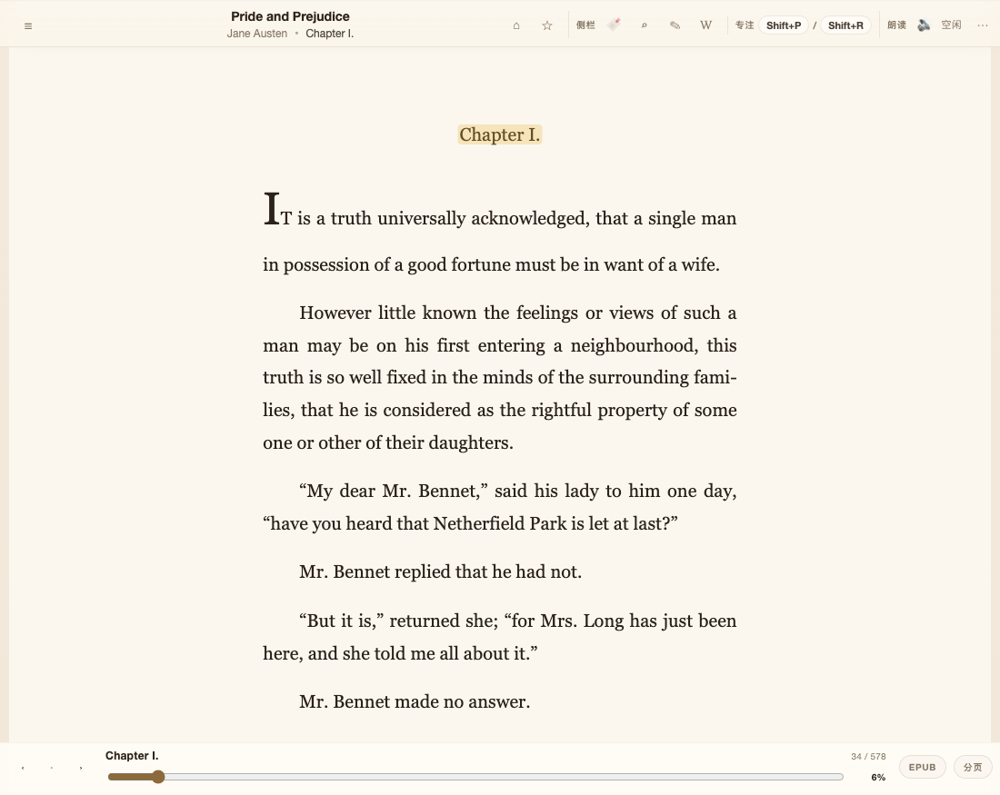
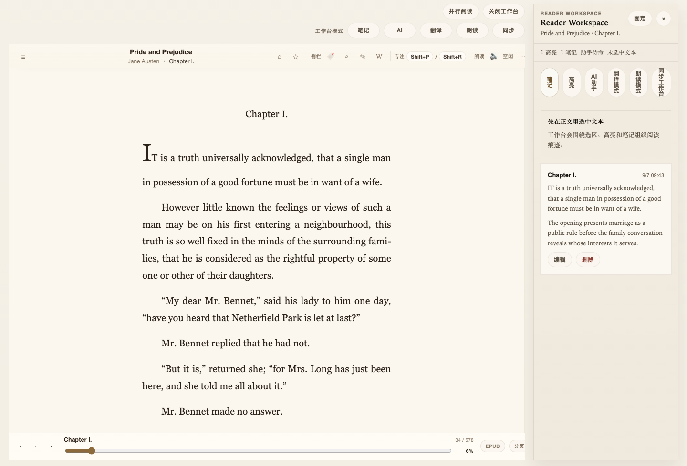
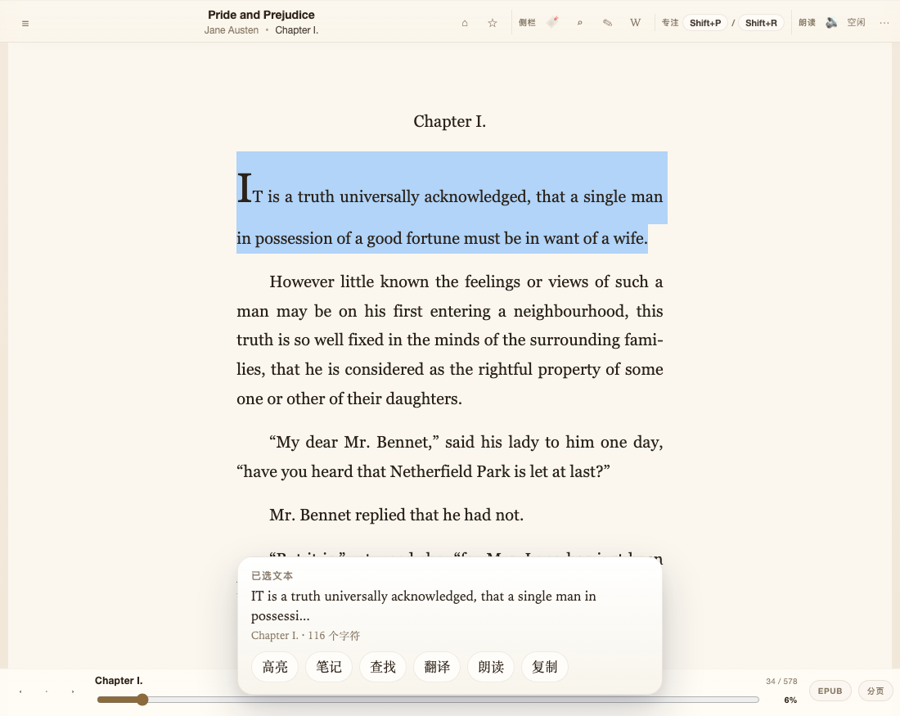
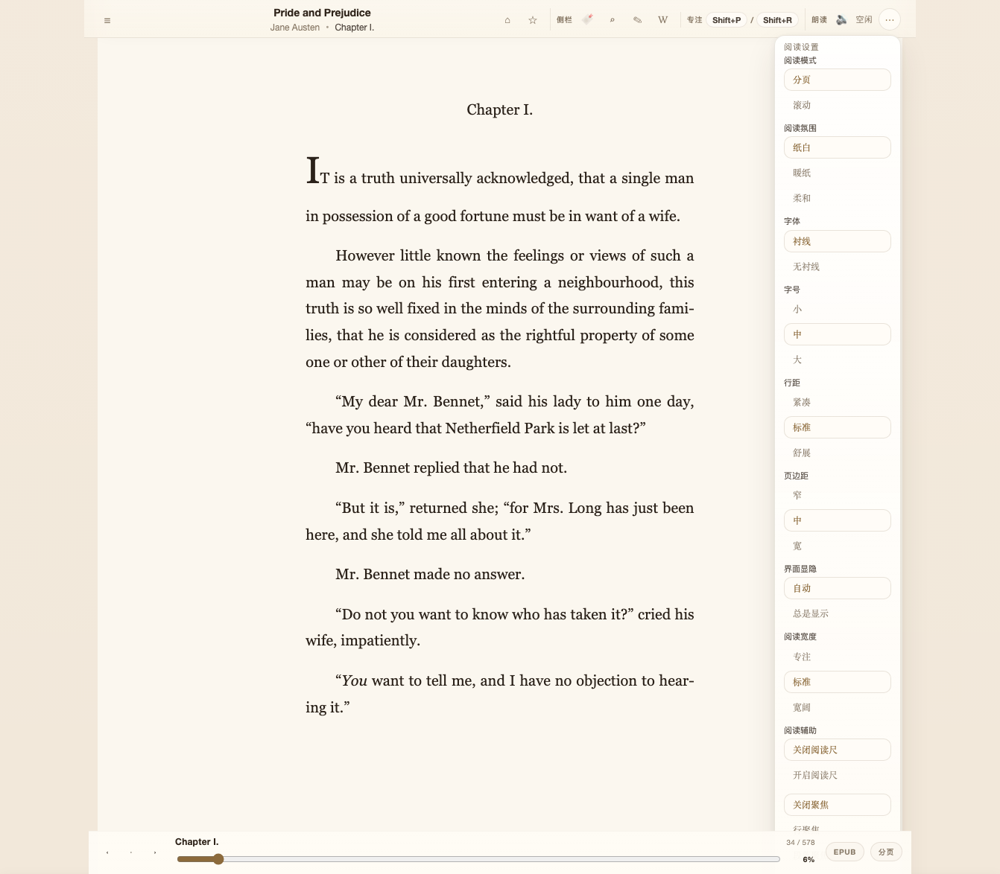
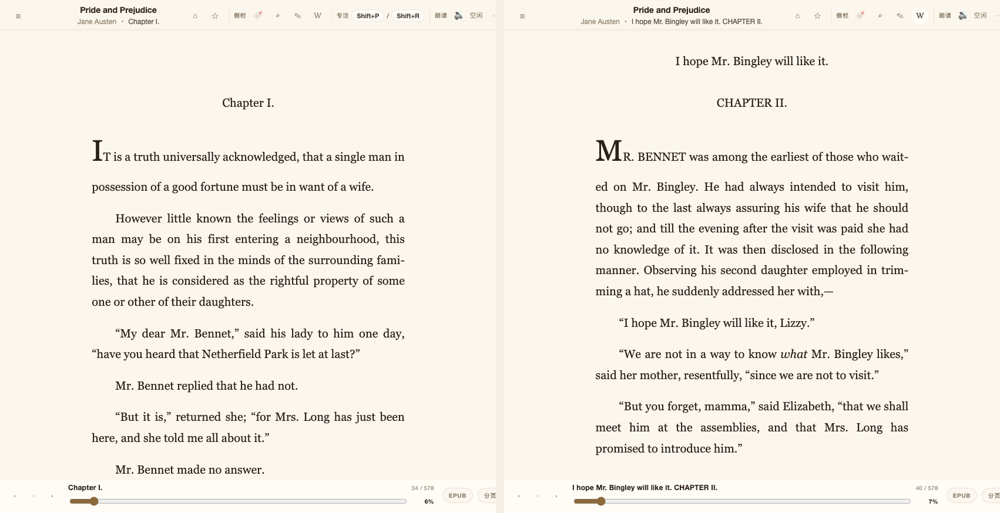
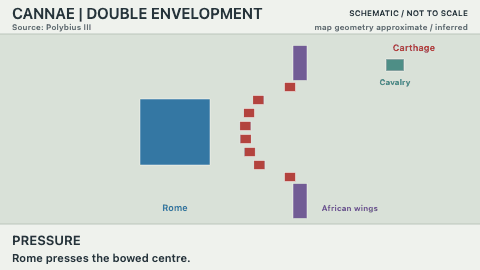
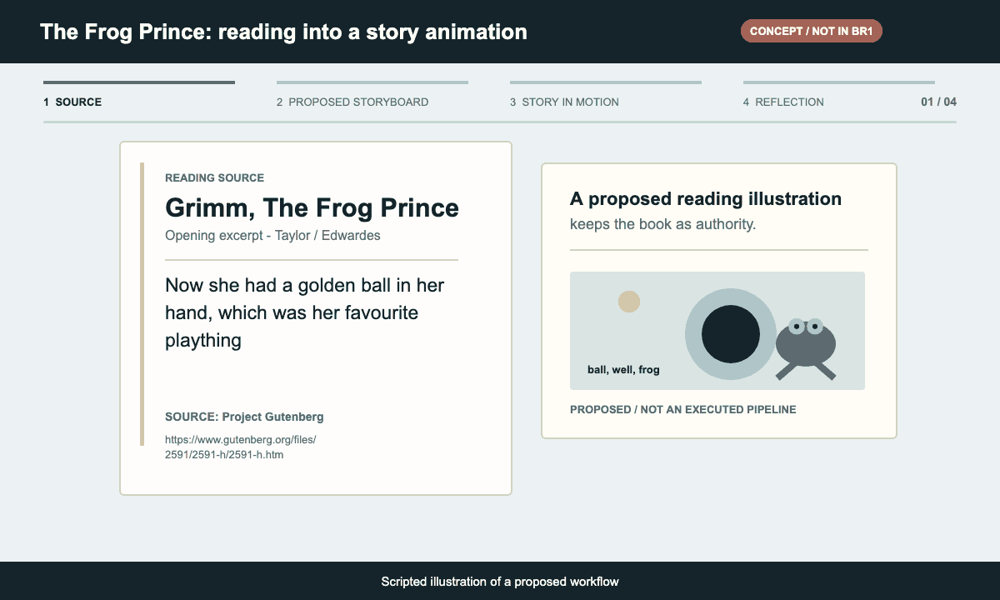

# Bridge Reader

**A reader first. A bridge from books to understanding and creation.**

Bridge Reader (`br1`) is an open-source, local-first desktop reader built with Tauri and SvelteKit. Read the original, keep your notes, and compare texts side by side. Our ambition is to help a difficult passage become an explanation you understand, a scene you can explore, or something you create.



## Available Today

- **Your local library:** import, organize, search, and reopen books.
- **EPUB, PDF, and TXT:** read with saved progress, bookmarks, highlights, and notes.
- **Reading comfort:** chapter navigation, in-book search, font and spacing controls, page or scroll layouts, and read-aloud tools.
- **Parallel reading:** compare two texts without leaving the reader.
- **Lookup and translation:** dictionary, Wikipedia, DeepL, and Yandex integrations. External services need network access; translation requires provider configuration. Submitted lookup terms and translation text are sent to the selected provider.

The project is under active development. The AI companions below are a direction, not shipped capabilities.

### Read, Mark, and Revisit

Select a passage, preserve a highlight, and keep your own interpretation beside the book. These are screenshots of the current web reader using Jane Austen's *Pride and Prejudice*, not mockups or test books.



<details>
<summary>See text selection, reading settings, and parallel panes</summary>

**Passage-level actions:** highlight, annotate, look up, translate, read aloud, or copy.



**Make the page comfortable:** adjust typography, spacing, margins, and reading mode.



**Keep two passages in view:** navigate the reading panes independently.



</details>

## Where We're Going

AI should help you stay with a book, not pull you into another chat window.

- **Meet the reader where they are.** Condense an argument, unpack a difficult passage, or connect it to a familiar example, guided by the reader's questions and chosen context.
- **Keep understanding alive.** Reconnect explanations, personal notes, and unfinished questions across reading sessions. Bring observations from a project or experiment back to the passage that inspired it.
- **Make ideas tangible.** Develop source-linked animations, games, and experiments with AI assistance. Use a well-made companion as it is, adapt it, or create your own.

Original text, interpretation, outside evidence, and creative adaptation should remain distinguishable. Personal reading must stand on its own; sharing is optional, and private context should not become public by default.

### From Ancient Strategy to a Playable Question

What does a principle in *The Art of War* depend on? Imagine turning a passage into a small tabletop scenario, trying a different route, then changing the terrain to expose the limits of the interpretation.



### From a Fairy Tale to an Animated Story

Imagine selecting *The Frog Prince*, generating a short storyboard and animation, then revising it with a teacher or parent. For primary-school reading, the story can open questions about sequence, motives, and promises, with a path back to the original.



**Both GIFs are scripted concept illustrations, not recordings of br1 generating games or animation.** The scenarios are creative adaptations, not historical simulations or evidence of learning outcomes. [Sources, boundaries, and replay](docs/demos/README.md).

## Help Build It

**We are seeking substantial, sustained LLM API/token credits and compute sponsorship.** This is more than generating one summary per book: long-form source processing, context-aware assistance, multimodal creation, and repeated checking and revision all require significant resources.

Support would fund development and evaluation, not a claim of existing large-scale usage. We intend to measure cost alongside usefulness and human review effort, and reuse good existing work where it helps.

We also welcome reader-engineering contributions, education and accessibility collaborators, and authors or teachers willing to help shape and evaluate reading companions.

[Discuss compute sponsorship or collaboration](https://github.com/ifquant/br1/issues/new?title=Bridge%20Reader%20sponsorship%20or%20collaboration)

## Build From Source

Requires Node.js, pnpm, and the sibling `foliate-js` checkout. Desktop builds also require Rust and the [Tauri 2 platform prerequisites](https://v2.tauri.app/start/prerequisites/).

```sh
git clone --branch performance https://github.com/ifquant/foliate-js.git
git clone https://github.com/ifquant/br1.git
cd foliate-js
npm ci
cd ../br1
pnpm install
pnpm dev --host 127.0.0.1
```

Open [the web frontend](http://127.0.0.1:1420/). Use `pnpm tauri dev` for the desktop app; web mode does not provide every desktop integration.

```sh
pnpm check
pnpm build        # Includes PDF vendor setup
pnpm tauri build # Desktop app and installers
```

Desktop bundles are written under `src-tauri/target/release/bundle/`.

## Acknowledgements

Bridge Reader draws on [Readest](https://github.com/readest/readest) and [Foliate](https://github.com/johnfactotum/foliate-js). Their reader-engineering foundations help us focus on a reading-first experience and its future AI bridge layer.
